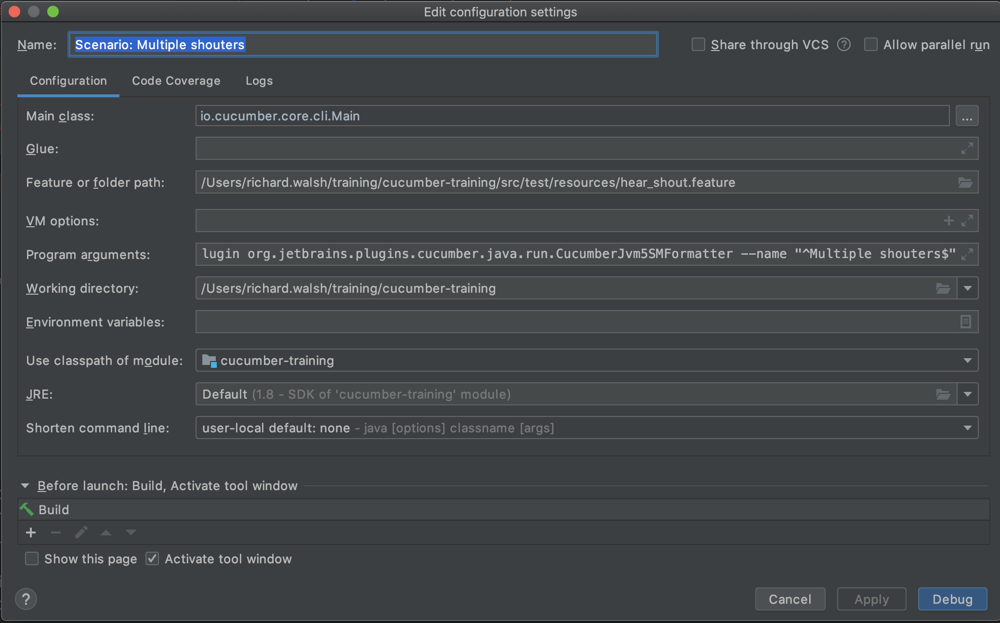

# cucumber-training-project

Simple java project to demonstrate cucumber framework 

## Prerequisites
Make sure you have installed all of the following prerequisites on your development machine:
* Git - [Download & Install Git](https://git-scm.com/downloads)
* Java 8  - [Download & Install Java](https://openjdk.java.net/install/)
* Maven  - [Download & Install Maven](https://maven.apache.org/download.cgi)
* Intellij - [Download & Install Intellij](https://www.jetbrains.com/idea/download/) (other IDES are supported but I haven't tested anything else! )
    * Intellij plugin - [Intellij gherkin plugin](https://plugins.jetbrains.com/plugin/9164-gherkin)
    * Intellij plugin - [Intellij cucumber-for-java plugin](https://plugins.jetbrains.com/plugin/7212-cucumber-for-java)

## Getting started
to build run `mvn clean install` in project root

Set up cucumber run configs as below:
 

Run scenarios by right clicking hear_shout.feature -> Run